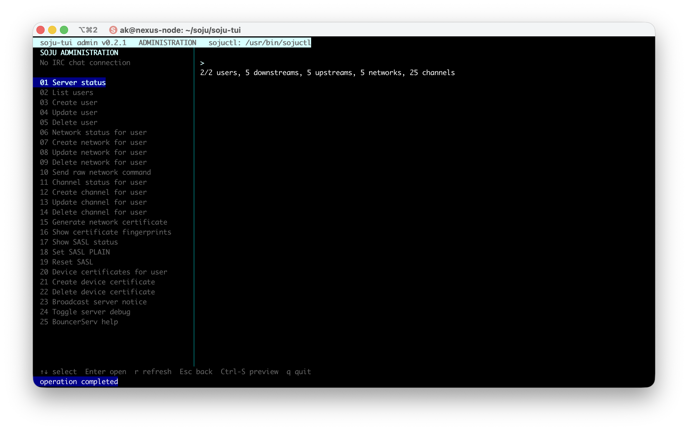
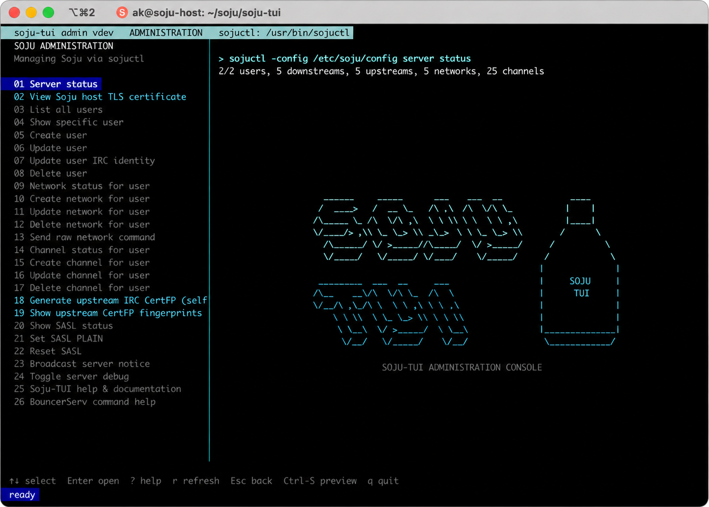

# soju-tui



`soju-tui` is an administration-only terminal frontend for the [soju IRC
bouncer](https://soju.im/). It manages the running instance through `sojuctl`;
it is not an IRC chat client and never opens channels or displays messages.

## Highlights

- Manage users, networks, channels, SASL, certificates, notices, and debugging.
- View the Soju host TLS certificate, including issuer, names, validity, hostname
  match, fingerprint, and PEM chain length.
- Select freshly discovered users, networks, and channels instead of retyping
  saved targets; manual entry remains available for unusually large listings.
- Inspect upstream CertFP fingerprints for one network or every saved network
  in a grouped, colorized view.
- Show only commands supported by the running Soju version.
- Preview every mutation as a redacted `sojuctl` command before confirmation.
- Open built-in, offline help with `?`, `F1`, or the help menu item.
- Use a responsive Soju-TUI bottle wordmark without crowding command output.
- Written in Go and distributed as self-contained Linux AMD64 and ARM64
  executables. Running those executables requires neither the Go toolchain nor
  ncurses; a running Soju instance and `sojuctl` are still required.



## Quick start

Soju must already be running with an administrative listener:

```text
listen unix+admin://
```

Preview and run the guided setup from the repository:

```sh
./scripts/setup.sh --dry-run
./scripts/setup.sh
```

The wizard installs the matching binary as `/usr/local/bin/soju-tui`. Run it as
the regular local user authorized by the wizard:

```sh
soju-tui
```

The first TUI launch asks you to confirm the discovered config, `sojuctl`,
hostname, admin socket, and TLS certificate paths before saving a non-secret
local profile. Rerun `./scripts/setup.sh` after pulling an updated binary; it
skips an unchanged installed copy and re-verifies administrative access.

The project is built and tested primarily on Debian with systemd. The TUI
executable itself does not depend on systemd; systemd is used by the guided
setup to persist the admin-socket ACL after Soju recreates the socket. The
prebuilt Linux executables work on AMD64 and ARM64 Linux environments with a
compatible terminal. Other Unix-like systems can build the host target and
configure admin-socket permissions with their native service manager.

## Documentation

- [Getting started](docs/getting-started.md) — requirements, setup, portability,
  and first launch
- [Using the TUI](docs/usage.md) — user selection, controls, operations, and
  certificate types
- [Soju command reference](docs/command-reference.md) — verified `sojuctl`
  syntax and corrections for common invalid forms
- [Certificate safety](docs/certificates.md) — Let's Encrypt host TLS, upstream
  CertFP preflight, and downstream device certificates
- [Building and releases](docs/building.md) — helper script, targets, versions,
  and verification
- [Security model](docs/security.md) — socket access, confirmations, secrets,
  and trust boundaries
- [Troubleshooting](docs/troubleshooting.md) — permissions, binaries, config,
  capability detection, and common failures

## Safety model

The TUI executes `sojuctl` with an argument vector and never invokes a shell.
Read-only actions run immediately. Every mutation requires review and approval;
destructive or high-risk actions require an exact typed phrase.

Passwords are never saved in the profile and are redacted from previews and
captured output. The TUI does not edit `/etc/soju/config`, modify Soju's database
directly, or silently invoke `sudo` during normal operation.

The implementation follows Soju's documented administration interfaces:

- [sojuctl manual](https://soju.im/doc/sojuctl.1.html)
- [soju configuration and IRC service manual](https://soju.im/doc/soju.1.html)
