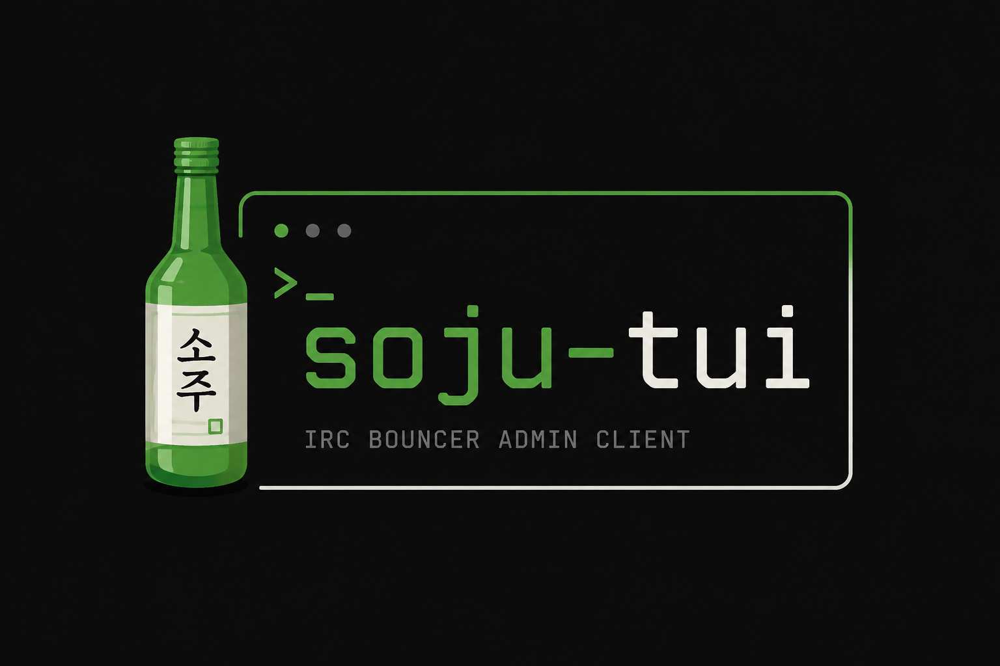
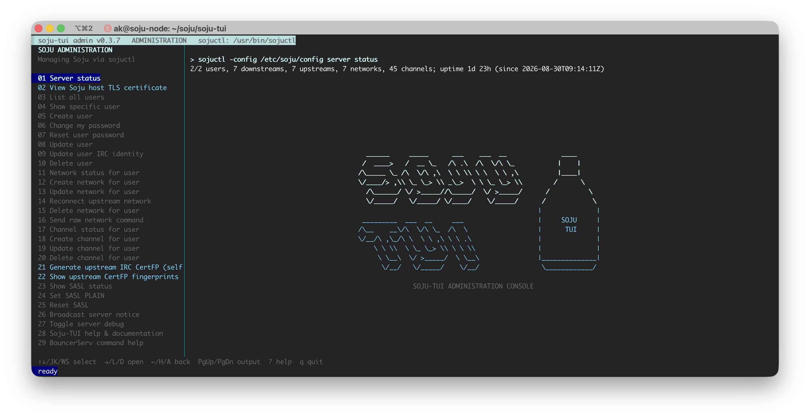

# soju-tui



`soju-tui` is an administration-only terminal frontend for the [soju IRC
bouncer](https://soju.im/). It manages the running instance through `sojuctl`;
it is not an IRC chat client and never opens channels or displays messages.

## Highlights

- Manage users—including dedicated password change and administrator-reset
  workflows—networks, channels, SASL, certificates, notices, and debugging.
- View the Soju host TLS certificate, including issuer, names, validity, hostname
  match, fingerprint, and PEM chain length.
- Select freshly discovered users, networks, and channels instead of retyping
  saved targets; manual entry remains available for unusually large listings.
- Inspect upstream CertFP fingerprints for one network or every saved network
  in a grouped, colorized view.
- On Linux/systemd hosts, augment server and connected-network status with
  exact RFC 3339 start times and compact elapsed ages when the corresponding
  Soju service and journal evidence are readable.
- Show only commands supported by the running Soju version.
- Verify release artifacts with SHA-256, embed the exact Git revision, and test
  the command contract against real Soju v0.9.0 and v0.10.1 instances in CI.
- Import the included Grafana dashboard to graph Soju's loopback-only
  Prometheus exporter without turning the interactive TUI into a service.
- Preview every mutation as a redacted `sojuctl` command in an effect-coded
  confirmation: green for additions, blue for changes, and red for destructive
  actions.
- Open built-in, offline help with `?`, `F1`, or the help menu item.
- Navigate menus and help with arrow keys, Vim `HJKL`, or WASD without
  intercepting text entered in forms and confirmations.
- Use a responsive Soju-TUI bottle wordmark without crowding command output.
- Written in Go and distributed as self-contained Linux AMD64 and ARM64
  executables and Debian/Ubuntu packages. Running them requires neither the Go
  toolchain nor ncurses; a running Soju instance and `sojuctl` are still
  required.



## Quick start

Soju must already be running with an administrative listener:

```text
listen unix+admin://
```

Debian and Ubuntu releases include architecture-specific packages. They install
the interactive command at `/usr/bin/soju-tui` without changing Soju, ACLs, or
systemd configuration. After installing the downloaded package, explicitly
authorize the trusted local administrator when needed:

```sh
sudo apt install ./soju-tui_VERSION-1_amd64.deb
sudo soju-tui-setup --user "$(id -un)"
soju-tui
```

Use the `arm64` package on AArch64. See
[Debian and Ubuntu packages](docs/debian-packages.md) for checksum verification,
upgrades, removal, and migration from `/usr/local/bin`.

For a manual installation at `/usr/local/bin` or another
administrator-selected path, preview and run the guided repository setup:

```sh
./scripts/setup.sh --dry-run
./scripts/setup.sh
```

By default, production setup downloads the latest stable, architecture-matched
Linux release from GitHub and verifies its `SHA256SUMS` manifest before
installation. Pin a release when you need a repeatable deployment:

```sh
./scripts/setup.sh --release 0.3.2
```

Development builds are intentionally rejected unless
`--allow-development-build` is supplied for local testing. To install a local
build instead of a GitHub release, pass it explicitly with `--binary` and, when
available, its `SHA256SUMS` file. This keeps normal deployments independent of
the repository's checked-in `dist/` files.

The manual-install wizard installs the verified release binary as
`/usr/local/bin/soju-tui`.
Run it as the regular local user authorized by the wizard:

```sh
soju-tui
```

The first TUI launch asks you to confirm the discovered config, `sojuctl`,
hostname, admin socket, and TLS certificate paths before saving a non-secret
local profile. Rerun `./scripts/setup.sh` after pulling an updated binary; it
skips an unchanged installed copy and re-verifies administrative access.

The project is built and tested primarily on Debian with systemd. The TUI
executable itself does not depend on systemd; systemd is used by the guided
setup to persist the admin-socket ACL after Soju recreates the socket. The
prebuilt Linux executables work on AMD64 and ARM64 Linux environments with a
compatible terminal. Other Unix-like systems can build the host target and
configure admin-socket permissions with their native service manager.

On Linux, the TUI also uses read-only `systemctl` and `journalctl` queries to
enrich status output when the configured Soju unit is available. This is an
optional inspection feature, not a service requirement: when either command or
the retained journal event is unavailable, the original `sojuctl` status is
shown unchanged. The default unit is `soju.service`; override it with
`-soju-systemd-unit UNIT` or `SOJU_SYSTEMD_UNIT`, or pass an empty value to
disable enrichment.

## Documentation

- [Getting started](docs/getting-started.md) — requirements, setup, portability,
  and first launch
- [Using the TUI](docs/usage.md) — user selection, controls, operations, and
  certificate types
- [Soju compatibility](docs/compatibility.md) — v0.9.0/v0.10.1 support,
  capability detection, and the Unix-network spelling difference
- [Soju command reference](docs/command-reference.md) — verified `sojuctl`
  syntax and corrections for common invalid forms
- [Certificate safety](docs/certificates.md) — Let's Encrypt host TLS, upstream
  CertFP preflight, and downstream device certificates
- [Building and releases](docs/building.md) — helper script, targets, versions,
  and verification
- [Debian and Ubuntu packages](docs/debian-packages.md) — package installation,
  explicit access setup, upgrades, removal, and path precedence
- [Grafana and Prometheus](grafana/README.md) — Soju exporter configuration,
  a production-safe scrape example, and the importable dashboard
- [GitHub repository and checks](docs/github-mirror.md) — GitHub Actions,
  automated releases, downstream mirroring, and the `main` ruleset
- [Security model](docs/security.md) — socket access, confirmations, secrets,
  and trust boundaries
- [Troubleshooting](docs/troubleshooting.md) — permissions, binaries, config,
  capability detection, and common failures
- [MIT license](LICENSE)

## Safety model

The TUI executes `sojuctl` with an argument vector and never invokes a shell.
Read-only actions run immediately. Every mutation requires review and approval;
destructive or high-risk actions require an exact typed phrase.

Passwords are never saved in the profile and are redacted from previews and
captured output. The TUI does not edit `/etc/soju/config`, modify Soju's database
directly, or silently invoke `sudo` during normal operation.

The implementation follows Soju's documented administration interfaces:

- [sojuctl manual](https://soju.im/doc/sojuctl.1.html)
- [soju configuration and IRC service manual](https://soju.im/doc/soju.1.html)

The command contract is explicitly regression-tested against upstream Soju
v0.9.0 and v0.10.1, including Debian's `0.9.0-1` and `0.10.1-1` packaging. See
[Soju version compatibility](docs/compatibility.md) for the exact boundary.
